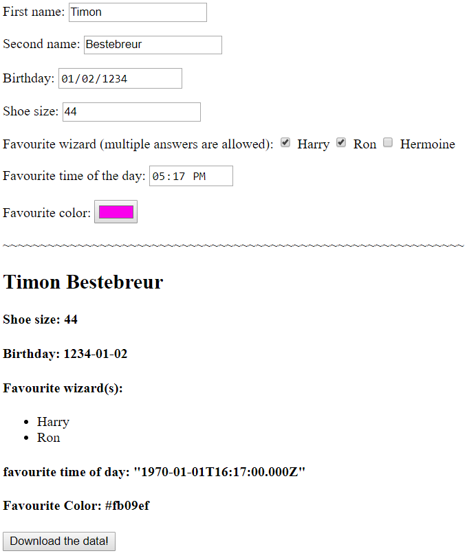

# profileGenerator
AngularJS/TypeScript project that gives you the ability to create your profile and then save it as a JSON. I made this to practice my AngularJS skills and to figure out how to download a JSON object as a .json file. I focused on the functionality, not on the visual design, so my html page is rocking standard css. Here is a screenshot of the final product:

